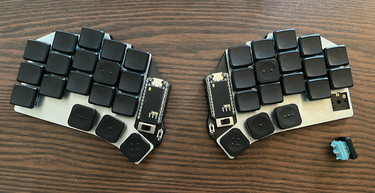

## Roost keyboard

Based off the Sweep v2.1, added 2mm or so horizontal space, added another set of keys and slots for a fat power switch. Moved battery connectors to the board, moved reset switch so it's easier to get to without being in the way. Larger holes are for mounting these: Mouser part: 575-7305015154727100 for pluggable switches.

Recently added v2 gerbers which use normal Kalih choc hot pluggable sockets as they're MUCH easier and more reliable to solder than the plugs.. Also did a few routing changes but it's otherwise the same board, same config.

Feel free to copy and modify..

